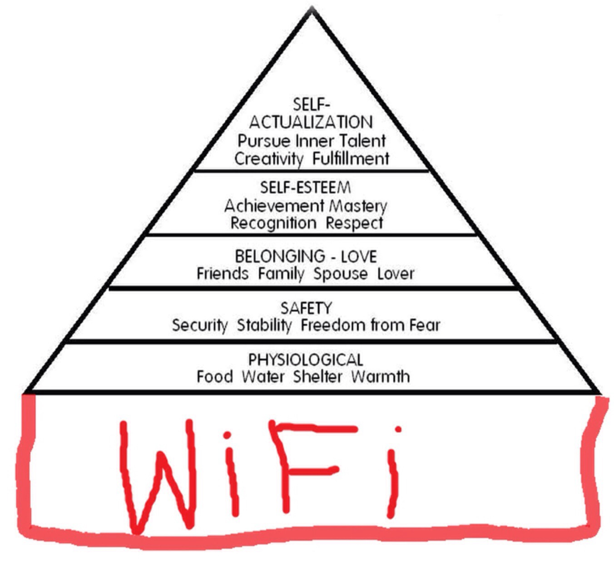

# Project 2: Open Data App - an RShiny app development project

### [Project Description](doc/project2_desc.md)

### Project Title: Busy Signal (https://huanhuan0608.shinyapps.io/app-gr1/)

+ Team Group 1 (Spring 2017)
	+ Ken Chew (kc3040)
	+ Sean Reddy (sr3336)
	+ Vikas Arun (va2298)
	+ Xuehan Liu (xl2615)
	+ Zhilin Fan (zf2169)
	


+ **Project summary**: Wifi has become one of the basic needs of our generation. Yet, we notice that there is very inadequate *free* wifi coverage where it is needed the most. Therein lies an opportunity: businesses (restaurants or hair salon, etc) can provide free wifi access where it is needed the most to attract wifi-hungry customers. What our app does is to tell business owners if their area is adequately covered given the human traffic and also the other free wifi hotspots available from LinkNYC or other establishments nearby like Starbucks or MacDonalds. 


+ **Contribution statement**: All team members contributed equally in all stages of this project. Specifically, Ken, Sean and Vikas worked on pulling/cleaning the data and writing the functions required to produce the heat maps. Xuehan and Zhilin worked on conceptualizing and implementing the Shiny App. All team members approve our work presented in this GitHub repository, including this contributions statement. 

Following [suggestions](http://nicercode.github.io/blog/2013-04-05-projects/) by [RICH FITZJOHN](http://nicercode.github.io/about/#Team) (@richfitz). This folder is organized as follows.

```
proj/
  app/
  lib/
  data/
  doc/
  output/
```

Please run the Shiny App from the "Global.R" file in the "app" folder.
